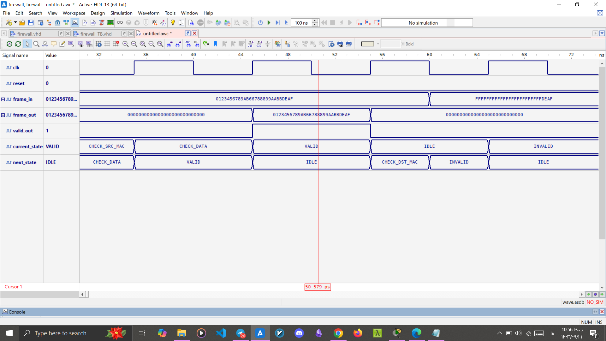

<html>
<head>
  <meta charset="UTF-8" />
</head>
<body>

<h1>FPGA-Hardware-Firewall</h1>

A lightweight hardware firewall and Ethernet frame sniffer implemented on FPGA using VHDL, with Python-based frame generation and simulation-driven validation.

<h2>Project Overview</h2>

This project implements a <strong>hardware firewall</strong> for monitoring and filtering Ethernet frames at the <strong>Data Link Layer</strong>. The core logic is written in VHDL and uses a finite state machine (FSM) to validate frames by checking destination MAC, source MAC, and payload content. A Python script built with Scapy generates test frames, and Wireshark is used to verify traffic and payload correctness.

<h2>Features</h2>

<ul>
  <li>FPGA-based Ethernet frame filtering.</li>
  <li>FSM-driven validation of valid and invalid frames.</li>
  <li>Support for frame sniffing and lightweight monitoring.</li>
  <li>Python + Scapy frame generation for testing.</li>
  <li>Wireshark-based traffic inspection.</li>
  <li>VHDL testbench for simulation.</li>
</ul>

<h2>Architecture</h2>

The system follows a simple pipeline:

<ol>
  <li>Receive an incoming Ethernet frame.</li>
  <li>Check the destination MAC address.</li>
  <li>Check the source MAC address.</li>
  <li>Inspect the payload data.</li>
  <li>Mark the frame as valid or invalid.</li>
  <li>Forward only valid frames to the output.</li>
</ol>

The design is implemented as an FSM with states such as <code>IDLE</code>, <code>CHECK_DST_MAC</code>, <code>CHECK_SRC_MAC</code>, <code>CHECK_DATA</code>, <code>VALID</code>, and <code>INVALID</code>.

<h2>Repository Structure</h2>

<pre><code>FPGA-Hardware-Firewall
├── src
│   ├── vhdl.vhdl
│   └── UCF.txt
├── sim
│   └── testbench.vhdl
├── scripts
│   └── framegen.py
├── docs
│   ├── testbench_st-2.jpg
│   ├── wireshark-output-1-3.jpg
│   └── wireshark-output-2.jpg
└── README.md
</code></pre>

<h2>Files</h2>

<ul>
  <li><code>src/vhdl.vhdl</code>: Main VHDL design for frame filtering.</li>
  <li><code>src/UCF.txt</code>: FPGA pin constraints file.</li>
  <li><code>sim/testbench.vhdl</code>: Testbench for validating the FSM in simulation.</li>
  <li><code>scripts/framegen.py</code>: Python script for generating Ethernet test frames.</li>
</ul>

<h2>Technologies Used</h2>

<ul>
  <li>VHDL</li>
  <li>FPGA</li>
  <li>Xilinx Artix-7 XC7A35T</li>
  <li>Python</li>
  <li>Scapy</li>
  <li>Wireshark</li>
  <li>Active-HDL</li>
  <li>Vivado</li>
</ul>

<h2>Simulation Results</h2>

The simulation showed that the FSM correctly distinguishes valid frames from invalid ones. The <code>valid_out</code> signal is asserted only when frame conditions are satisfied. The waveform below demonstrates the state transitions and output behavior.

<h2>Wireshark Validation</h2>

The generated Ethernet frames were captured and verified in Wireshark. The filter <code>frame contains DEADBEEF</code> highlights packets carrying the expected payload. This confirms that the Python frame generator is producing the intended traffic.

This packet detail view shows the frame structure, including source and destination MAC addresses, EtherType, and the payload bytes. The displayed bytes match the generated test data exactly.

<h2>Test Frame Generation</h2>

The <code>framegen.py</code> script creates Ethernet frames using Scapy. Every tenth frame can carry a known payload such as <code>DEADBEEF</code>, while other frames may contain random data. This makes it easy to test both acceptance and rejection paths in the firewall logic.

<h2>Limitations</h2>

<ul>
  <li>Hardware-level validation on the physical FPGA board was not completed in this phase.</li>
  <li>Simulation cannot reproduce all real-world effects such as noise, network delay, or NIC-specific behavior.</li>
  <li>CRC verification and end-to-end hardware testing can be added in future work.</li>
</ul>

<h2>Future Work</h2>

<ul>
  <li>Full deployment on the FPGA board.</li>
  <li>CRC checking for stronger frame validation.</li>
  <li>Rule-based filtering for MAC, EtherType, and payload patterns.</li>
  <li>Packet logging and statistics counters.</li>
  <li>Optional lightweight inspection features for network security applications.</li>
</ul>

</body>
</html>
